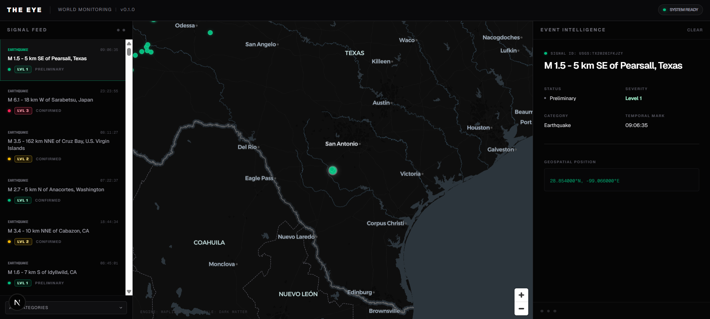

# TheEye

TheEye is a **map-first global signal platform** built as a structured monorepo.

It exists to collect, normalize, and present meaningful world signals through one coherent event-driven experience. The current working baseline is **v0.2.0 - Multi-Source Ingestion**: a local Docker-backed system with a Go API, USGS earthquake and NASA EONET ingestion behind a shared source interface, stored normalized events, and a map/feed/detail dashboard.

The long-term product direction is broader than a natural disaster dashboard. Natural and physical events are the first practical signal family, but TheEye can evolve toward human systems, global stability, critical infrastructure, and other high-value world signals as reliable source boundaries emerge.

---


v0.1.0 - Initial Working MVP

## Purpose

TheEye reduces fragmentation across world-signal sources by giving users one readable place to understand:

- what is happening
- where it is happening
- why it matters

Near-term delivery stays focused on reliable multi-source event monitoring: ingestion, normalization, storage, API stability, and a map-first dashboard flow.

Guiding principles:

- fast initial signal
- map-first exploration
- normalized event model
- controlled, reviewable engineering
- stable local development with Docker-based infrastructure

---

## Current Working Model

TheEye is built with AI assistance, but the rules are **model-agnostic**. No task is reserved for a specific tool or model; contributors use whichever assistant they prefer. What is fixed is the process, not the participant.

Every contributor, human or agent, reads `AGENTS.md` first. It holds the engineering rules, the working principles, the contribution conventions, and the source-of-truth order. Tool-specific files such as `CLAUDE.md` only add tool-specific detail and defer to `AGENTS.md` on any conflict.

Planning follows **Version Milestones**, not Phase/Sprint documents.

Current documented progress snapshot:

- `docs/VERSION_PLAN.md`
- `CHANGELOG.md`

---

## Backend-First Integration Rule

Frontend work must follow the latest stabilized backend contract.

When a change affects the frontend/backend boundary, use this order:

1. Define the target version milestone, work item, implementation slice, and constraints.
2. Implement the backend or contract-changing slice first.
3. Read the latest backend contract and report frontend integration impact before writing UI code.
4. Patch the backend if the contract turns out to be incomplete or awkward for the UI.
5. Implement the frontend against the finalized backend behavior.
6. Review the integrated result when the change is risky, milestone-level, or cross-cutting.
7. Sync documentation last, if behavior or project state changed.

This rule exists to reduce silent contract drift.

---

## Repository Structure

```text
TheEye/
|- apps/
|  |- dashboard/                  # Frontend application
|- services/
|  |- api/                        # Go API service
|  |- collector/                  # Ingestion workers/connectors
|- infra/
|  |- docker-compose.yml          # Local infrastructure and service orchestration
|  |- .env.example                # Optional local overrides; defaults live in compose
|- docs/
|  |- VISION.md                   # Long-term product north star
|  |- ROADMAP.md                  # High-level version milestone roadmap
|  |- VERSION_PLAN.md             # Active milestone plan and version rules
|  |- ARCHITECTURE.md             # Current technical architecture
|  |- API.md                      # Current API contract
|  |- DB.md                       # Current persistence baseline and planned DB direction
|- scripts/                       # Helper scripts
|- .agents/skills/                # Vendored agent skills, pinned in skills-lock.json
|- .claude/                       # Claude Code permissions and slash commands
|- .husky/                        # Git hooks: gofmt, lint-staged, commitlint
|- .github/workflows/ci.yaml      # CI: backend matrix and dashboard checks
|- README.md
|- AGENTS.md
|- CLAUDE.md
|- CONTRIBUTING.md
|- CHANGELOG.md
```

---

## Document Map

### `docs/VISION.md`

Use for long-term product meaning, MVP boundaries, and the broader map-first global signal direction.

### `docs/VERSION_PLAN.md`

Use for active version milestone planning, version rules, completed scope, and planned direction.

### `docs/ROADMAP.md`

Use for high-level roadmap orientation. It should stay concise and should not become a detailed task list.

### `docs/ARCHITECTURE.md`

Use for current system structure, service responsibilities, and ingestion-to-dashboard flow.

### `docs/API.md`

Use for current backend API contract and planned-but-not-active API notes.

### `docs/DB.md`

Use for current event persistence behavior, idempotency rules, and planned database direction.

### `AGENTS.md`

The source of truth. Engineering rules, the `Event` contract, local dev constraints, working principles, branch and commit conventions, quick commands, and available skills.

### `CONTRIBUTING.md`

Use for the human contribution flow: what to read first, how to scope a change, and what a pull request should contain.

### `CLAUDE.md`

Tool-specific notes for Claude Code. Defers to `AGENTS.md` on any conflict.

---

## Source of Truth Order

If documents conflict, follow this priority:

1. `AGENTS.md`
2. `docs/VISION.md`
3. `docs/VERSION_PLAN.md`
4. `docs/ROADMAP.md`
5. `docs/ARCHITECTURE.md`
6. `docs/API.md`
7. `docs/DB.md`
8. `README.md`
9. code

Implementation must follow the documented plan, not invent a new one.

---

## Local Development

The local development flow must remain stable.

### First-time setup

```bash
pnpm install
```

Run this once at the repository root. It installs the workspace and activates the Git hooks in `.husky/`, which check `gofmt` on staged Go files and validate commit messages.

### Start infrastructure and local stack

```bash
docker compose -f ./infra/docker-compose.yml up --build
```

This is the baseline entry point for local development and supports:

- PostgreSQL / PostGIS
- Redis
- API service
- collector service

Compose ships with working defaults, so no `.env` file is required. Copy `infra/.env.example` to `infra/.env` only when you need to change ports, credentials, or collector tuning.

### Stop local stack

```bash
docker compose -f ./infra/docker-compose.yml down
```

### Frontend development

```bash
pnpm --filter dashboard dev
```

### Verify a change

```bash
pnpm --filter dashboard lint
pnpm --filter dashboard typecheck
pnpm --filter dashboard test
pnpm --filter dashboard build

cd services/api       && go vet ./... && go test ./...
cd services/collector && go vet ./... && go test ./...
```

---

## Continuous Integration

`.github/workflows/ci.yaml` runs on every push and pull request against `master`:

| Job | What it does |
| --- | --- |
| `Backend (api)` | `gofmt` check, `go vet`, `go test`, `go build` for `services/api` |
| `Backend (collector)` | the same checks for `services/collector` |
| `Dashboard` | `pnpm install --frozen-lockfile`, lint, typecheck, test, build |

The dashboard job installs from the workspace root with a frozen lockfile, so a dependency change that does not update `pnpm-lock.yaml` fails CI instead of drifting silently.

---

## Development Workflow Summary

A clean working loop for this repository is:

1. confirm the target version milestone, work item, and implementation slice
2. clarify constraints and open questions before writing code
3. implement backend or contract-changing work first
4. check the latest backend contract for frontend impact
5. patch the backend if needed
6. implement the frontend only after the contract is stable
7. review the integrated result for risky, milestone, or cross-cutting changes
8. sync docs last when state changed
9. commit a clean, scoped unit following the conventions in `AGENTS.md`
10. create a tag only after a meaningful milestone

---

## Scope Discipline

To avoid repo drift:

- do not mix unrelated work in one change set
- do not silently expand the active work item
- do not treat tool output as a project decision until reflected in docs
- do not let frontend invent backend fields or endpoints
- do not break the Docker-based local workflow

---

## Tagging Philosophy

Tags should be milestone-based, not commit-based.

Prefer creating tags when:

- a meaningful version milestone is complete
- docs are synced
- `VERSION` matches the intended Git tag
- generated UI version files are synced with `pnpm version:sync`
- `pnpm version:check vMAJOR.MINOR.PATCH` passes
- the working tree is clean
- the result is reviewed and intentionally checkpointed

---

## Final Note

TheEye should be built in a way that remains understandable, traceable, and stable even when multiple AI tools are involved.

When in doubt, the documented project direction wins.
